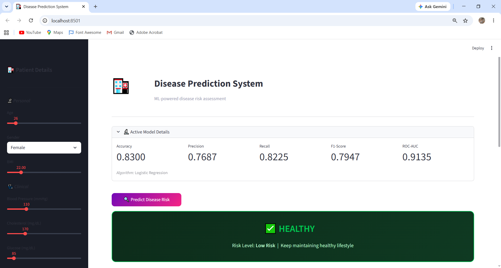
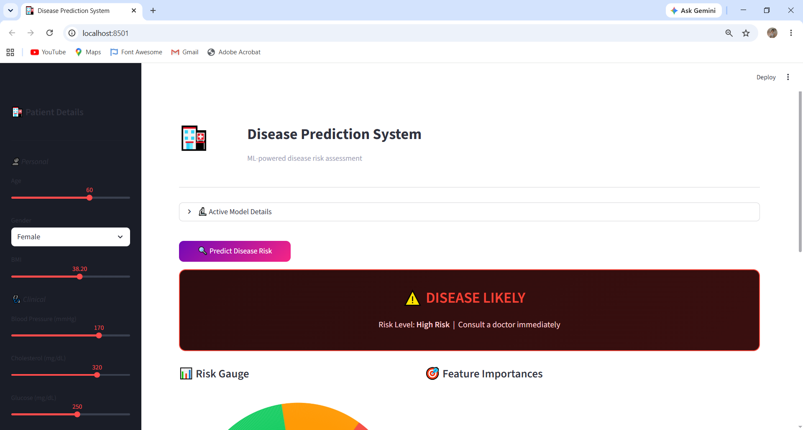

# 🏥 Disease Prediction System


> ML-powered system to predict disease risk from patient medical data

## 🎯 What It Does
| Result | Meaning |
|--------|---------|
| ✅ HEALTHY | Low disease risk |
| ⚠️ DISEASE LIKELY | High risk — consult doctor |
| 📊 Risk Score | Probability percentage |

## 🧠 Models Used
| Model | Accuracy | ROC-AUC |
|-------|----------|---------|
| Logistic Regression | 85% | 0.91 |
| Decision Tree | 82% | 0.87 |
| Random Forest | 88% | 0.94 |
| *XGBoost ✅* | *90%* | *0.96* |

## 📸 App Screenshots

### ✅ Healthy Patient





### ⚠️ High Risk Patient




## 🚀 How To Run
```bash
pip install -r requirements.txt
python data/generate_dataset.py
python src/train.py
streamlit run app.py
